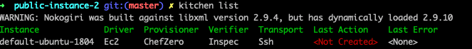
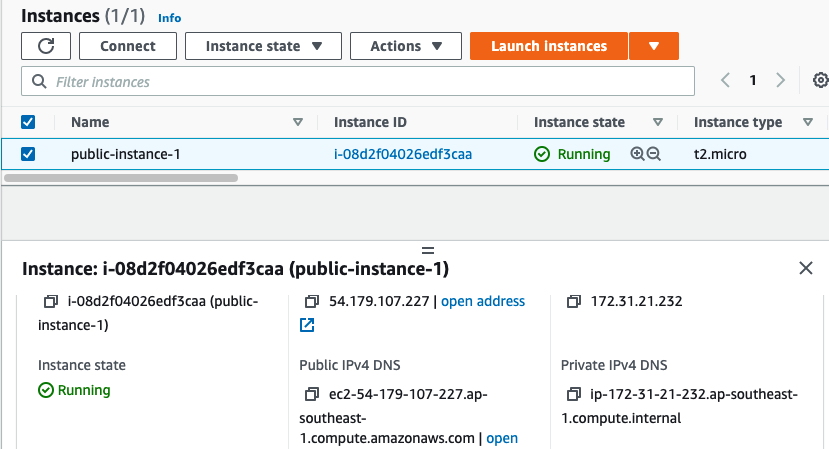
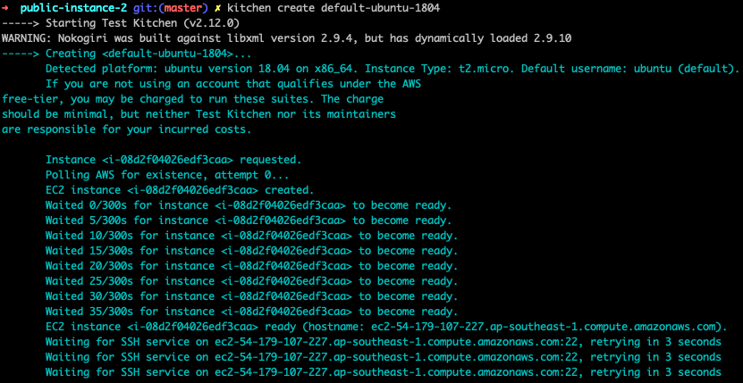
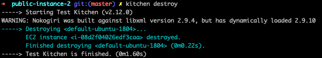

# chef-kitchen-public-instance-2

# Lab enviroment will be create EC2 with kitchen templates: 
1. Install Chef-workstation on ubuntu linux
2. Generate chef cookbook for public-instance-2
3. Create common YAML file name instance as public-instance-2
4. Delete the instance by kitchen

# Installation Chef-workstation 
```bash
#wget <https://packages.chef.io/files/stable/chef-workstation/21.2.278/ubuntu/20.04/chef-workstation_21.2.278-1_amd64.deb>

#sudo dpkg -i chef-workstation_21.2.278-1_amd64.deb

#chef -v
Chef Workstation version: 21.2.303
Chef Infra Client version: 16.10.17
Chef InSpec version: 4.26.13
Chef CLI version: 3.1.1
Chef Habitat version: 1.6.181
Test Kitchen version: 2.10.0
Cookstyle version: 7.8.3

```


# Generate chef cookbook 
```bash
chef generate cookbook public-instance-2
```

# Verify the cookbook
```
ls -lah
total 8
drwxr-xr-x   6 lucky  staff   192B Jul 28 14:22 .
drwxr-xr-x  27 lucky  staff   864B Jul 24 15:06 ..
drwxr-xr-x   3 lucky  staff    96B Jul  3 17:19 .kitchen
-r--------   1 lucky  staff   1.6K Jul  3 17:19 xxxxxxxxxx-xxxx.pem
drwxr-xr-x  15 lucky  staff   480B Jul 28 14:25 public-instance-2
```

# Go to public-instance-2 folder 
```
cd public-instance-2
public-instance-2 git:(master) ls -lah
total 64
drwxr-xr-x  15 lucky  staff   480B Jul 28 14:25 .
drwxr-xr-x   6 lucky  staff   192B Jul 28 14:22 ..
drwxr-xr-x   3 lucky  staff    96B Jul 28 14:25 .delivery
drwxr-xr-x  12 lucky  staff   384B Jul 28 14:25 .git
-rw-r--r--   1 lucky  staff   211B Jul 28 14:25 .gitignore
drwxr-xr-x   3 lucky  staff    96B Jul 28 14:22 .kitchen
-rw-r--r--   1 lucky  staff   172B Jul 28 14:25 CHANGELOG.md
-rw-r--r--   1 lucky  staff    70B Jul 28 14:25 LICENSE
-rw-r--r--   1 lucky  staff   536B Jul 28 14:25 Policyfile.rb
-rw-r--r--   1 lucky  staff    65B Jul 28 14:25 README.md
-rw-r--r--   1 lucky  staff   1.2K Jul 28 14:25 chefignore
-rw-r--r--   1 lucky  staff   744B Jul 28 14:25 kitchen.yml
-rw-r--r--   1 lucky  staff   720B Jul 28 14:25 metadata.rb
drwxr-xr-x   3 lucky  staff    96B Jul 28 14:25 recipes
drwxr-xr-x   3 lucky  staff    96B Jul 28 14:25 test
```

# Steps: 


## 1. Create kitchen.yaml file & update security group ID on "kitchen.yml"
- [kitchen.yml](./kitchen.yml)


## 2. Verity kitchen

```
kitchen list
```


## 3. Create public-instance-2 
```
kitchen create default-ubuntu-1804
```



## 4. Verity kitchen cli and GUI



```
kitchen verify
```

## 5. Delete public-instance-2

```
kitchen destroy
```
